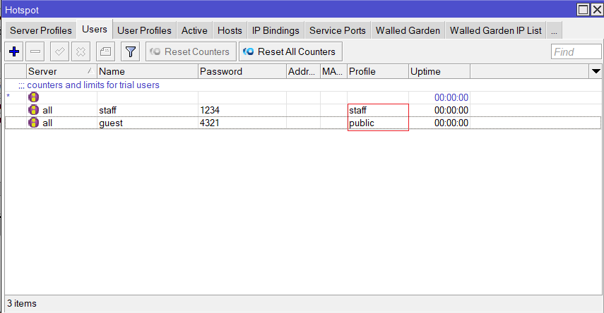

# USK Paket 1 PT Bonet

## A. Topologi

### 1. Mikrotik
### 2. Proxmox

## B.  Konfigurasi Mikrotik
### 1. setup
#### a. Mengubah Identitas Router

#### b. Menambahkan IP DHCP-Client pada Ether1 untuk Akses Internet

#### c. Menetapkan IP Address pada Interface Ether2 dan Ether3

#### d. Verifikasi Koneksi ke Internet dan Server Proxmox Lokal

#### e. Mengonfigurasi Firewall NAT untuk Akses Internet melalui Ether1 serta Bypass untuk Akses Klien ke VM Proxmox

<!-- truncate -->

### 2. Hospot
#### a. Membuat Hotspot pada Interface Lokal (Ether3)
- Interface: ether3 (lokal) \
  
- Address Lokal: 192.168.0.1/24 \
  
- Rentang Alamat IP Pool: 192.168.0.2-192.168.0.100 \
  
- DNS Server: 192.168.0.1 (gateway) dan 8.8.8.8 untuk internet \
  
- Nama Domain Hotspot: login.usk-tkj.net *(opsional)* \
  
- Menonaktifkan Cookie Server pada Hotspot agar meningkatkan keamanan akses \
  

#### b. Membuat Pengguna dengan Pengaturan Bandwidth dan Address List
- Membuat User Profile untuk kategori *staff* dan *guest*, dengan batasan bandwidth 5 Mbps untuk *staff* dan 2 Mbps untuk *guest*
  
- Menambahkan pengguna dengan profil yang telah dibuat
  
- Verifikasi login serta pengujian bandwidth untuk pengguna *staff*
  <!--  -->
  
- Pengujian bandwidth juga dilakukan untuk pengguna *guest*
  

### 3. firewall
#### a. Menambahkan Firewall untuk Membatasi Akses Guest ke Server Proxmox
- Membuat aturan firewall dengan *chain forward* serta *dst-address* menuju 10.1.10.0/24
  
- Menambahkan *src-address-list* untuk mengidentifikasi pengguna *guest*
  
- Mengatur aksi *drop* untuk memblokir akses pengguna *guest* ke server VM
  
- Verifikasi bahwa pengguna *staff* masih bisa melakukan *ping* ke 8.8.8.8 dan 10.1.10.2
  
- Verifikasi bahwa pengguna *guest* tidak dapat mengakses VM Proxmox
  

### 4. konfigurasi dns
#### a. Menambahkan DNS Statis untuk Lookup ke VM1 dan VM2
- Mengaktifkan *allow remote request* serta menambahkan DNS Server untuk VM1
  
- Menambahkan DNS statis untuk *usk-tkj.net*, *ftp.usk-tkj.net* ke VM1, serta *www.usk-tkj.net* ke VM2
  