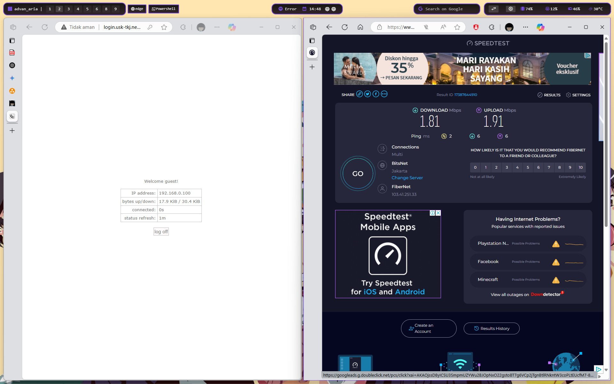

# USK Paket 1 PT Bonet

## A. Topologi


### 1. Mikrotik
### 2. Proxmox

## B.  Konfigurasi Mikrotik
### 1. setup
#### a. Mengubah Identitas Router


#### b. Menambahkan IP DHCP-Client pada Ether1 untuk Akses Internet


#### c. Menetapkan IP Address pada Interface Ether2 dan Ether3


#### d. Verifikasi Koneksi ke Internet dan Server Proxmox Lokal


#### e. Mengonfigurasi Firewall NAT untuk proxmox akses internet melalui Ether1 serta Bypass untuk Akses Klien ke VM Proxmox


<!-- truncate -->

### 2. Hotspot
#### a. Membuat Hotspot pada Interface Lokal (Ether3)
- Hotspot Interface: Ether3
- Local Address: 192.168.100.1/29
- Address Pool: 192.168.100.2-192.168.100.6
- DNS Servers: 192.168.100.1
- DNS Name: hotspot.ukk-tkj.net

#### b. Menonaktifkan Cookie Server pada Hotspot untuk meningkatkan keamanan akses. 


#### c. Membuat Pengguna dengan Pengaturan Bandwidth dan Address List


#### d. Verifikasi login serta pengujian bandwidth untuk pengguna staff.


#### e. Pengujian bandwidth juga dilakukan untuk pengguna guest.


### 3. Firewall
#### a. Menambahkan Firewall untuk Membatasi Akses Guest ke Server Proxmox


#### b. Verifikasi bahwa pengguna *guest* tidak bisa melakukan *ping* ke `10.1.10.2`

### 4. Konfigurasi DNS Mikrotik
#### a. **Mengaktifkan Allow Remote Request**
- Mengaktifkan opsi *Allow Remote Request* untuk memungkinkan permintaan DNS dari klien eksternal.
- Menambahkan konfigurasi DNS Server untuk VM1.
  

## C. setup VM
### 1. setup hostname, dan ip, repository
#### a. Setup Hostname dan IP
1. Di sini saya menggunakan VM 501 dan 502 \
      
2. Selanjutnya, saya mengubah alamat IP vm1 sebagai berikut (ubah ip address, gateway, dan dns sesuai ): \
   
3. Selanjutnya, saya mengubah alamat IP vm2 sebagai berikut (ubah ip address, gateway, dan dns sesuai ): \
   
4. dan juga jangan lupa ubah hostname
   ```bash
   hostnamectl set-hostname serv1
   bash
   ```

### 2. setup repository
#### a. Mematikan Repository Online
Buka file konfigurasi repository:
```bash
vi /etc/rhsm/rhsm.conf
```
Ubah baris berikut:
```ini
manage_repos = 1
```
Menjadi:
```ini
manage_repos = 0
```

#### b. Setup Repository Lokal
Buka atau buat file repository lokal:
```bash
vi /etc/yum.repos.d/local.repo
```
Tambahkan konfigurasi berikut:
```ini
[BaseOS]
name=BaseOS
baseurl=http://10.1.10.115/rhel9.4/BaseOS
gpgcheck=0
enabled=1

[AppStream]
name=AppStream
baseurl=http://10.1.10.115/rhel9.4/AppStream
gpgcheck=0
enabled=1
```

## D. Konfigurasi VM 2
#### a. installasi package yang dibutuhkan
```bash
yum install ftp podman haproxy bind-utils
```

#### b. mematikan selinux, dan firewalld
```bash
systemctl stop firewalld
setenforce 0
```

#### c. create container
```bash
mkdir -p /var/www/html/ukk/web{1..2}

podman run -itd --name web1 -p 8001:80 -v /var/www/html/ukk/web1/:/usr/share/nginx/html nginx
podman run -itd --name web2 -p 8002:80 -v /var/www/html/ukk/web2/:/usr/share/nginx/html nginx

echo "welcome to container1" > /var/www/html/ukk/web1/index.html
echo "welcome to container2" > /var/www/html/ukk/web2/index.html
```

#### d. create haproxy
```bash
vi /etc/haproxy/haproxy.cfg
###
frontend fe
    bind *:80
    default_backend be
    stats enable
    stats uri /stats

backend be
    balance roundrobin
    server web1 127.0.0.1:8001 check
    server web2 127.0.0.1:8002 check
###

systemctl enable --now haproxy
```

#### e. create ssh-key and copy pub key to vm 1
```bash
ssh-keygen

ssh-copy-id root@ip_vm1
```

#### e. verifikasi haproxy


## E. Konfigurasi ftp server VM 1
#### a. installasi package yang dibutuhkan
```bash
yum install vsftpd ftp bind bind-utils
```

#### b. mematikan selinux, dan firewalld
```bash
systemctl stop firewalld
setenforce 0
```

#### c. create ssh-key and copy pub key to vm 2
```bash
ssh-keygen

ssh-copy-id root@ip_vm2
```

#### d. mengubah port ssh 2023
1. ubah konfigurasi
  ```bash
  vi /etc/ssh/sshd_config
  ```
2. ubah port ini \
  

3. akukan restart service sshd
  ```bash
  systemctl restart sshd
  ```

#### e. create ftp server
1. membuat user baru dengan nama **ukk**, dan password **123**
   ```
   useradd ukk
   passwd ukk
   ```
2. ubah konfigurasi ftp server
   ```bash
   vi /etc/vsftpd/vsftpd.conf
   ```
3. uncommand ini
   ```bash
   chroot_local_user=YES
   ```
4. tambahkan bagian bawah
   ```bash
   allow_writeable_chroot=YES
   local_root=/home/ukk
   ```
5. enable vsftpd
   ```bash
   systemctl enable --now vsftpd
   ```
6. copy private and pub key to directroy /home/ukk
   ```bash
   cp /root/.ssh/id_rsa /home/ukk/vm1_key
   cp /root/.ssh/id_rsa.pub /home/ukk/vm2_pub
   ```
7. login ke vm2 dan upload file kunci vm1 ke ftp server
  ```bash
  ssh root@ip_vm1

  ftp ip_vm1 
  # login user:ukk, pass:123

  put .ssh/id_rsa vm1_key
  put .ssh/id_rsa.pub vm1_pub
  
  exit
  exit
  ```

### f. create dns server
1. ubah configurasi named
   ```bash
   vi /etc/named.conf
   ```
    \
   yang diubah yang ini
   ```bash
   listen-on port 53 { 127.0.0.1; ip_vm1; };
   allow-query     { localhost; any; };
   allow-transfer  { localhost; any; };
   ```
3. tambahkan conf rfc
   ```bash
   vi /etc/named.rfc1912.zones
   ###
   zone "ukk-tkj.net" IN {
            type master;
            file "db.forward";
            allow-update { none; };
   };
   zone "10.1.10.in-addr.arpa" IN {
            type master;
            file "db.reverse";
            allow-update { none; };
   };
   ###
   ```
4. buat file db.forward dan db.reverse
   ```bash
   cd /var/named
   cp named.localhost db.forward
   cp named.localhost db.reverse
   chown -R named:named /var/named
   ```
5. ubah konfigurasi db.forward
   ```bash
   vi db.forward
   ```
   
   yang di ubah yang **@** menjadi **ukk-tkj.net.**, dan tambahkan ini
   ```bash
   @       IN NS   ukk-tkj.net.
   @       IN A    ip_vm1
   ns      IN A    ip_vm1
   ftp     IN A    ip_vm1
   www     IN A    ip_vm2
   ```
6. ubah konfigurasi db.reverse
   ```bash
   vi db.reverse
   ```

   yang di ubah yang **@** menjadi **ukk-tkj.net.**, dan tambahkan ini
   ```bash
   @       IN NS   ukk-tkj.net.
   akhiran_ip_vm1      IN PTR  ns.ukk-tkj.net.
   akhiran_ip_vm1      IN PTR  ftp.ukk-tkj.net.
   akhiran_ip_vm2      IN PTR  www.ukk-tkj.net.
   ```
5. enable named
   ```bash
   systemctl enable --now named
   ```