# BGP RPKI

Pada lab ini, kita akan melihat bagaimana trafik bisa beralih ke server palsu ketika router menerima pengumuman BGP yang lebih spesifik. Setelah itu, kita menerapkan **Route Origin Validation (ROV)** menggunakan data RPKI di MikroTik agar pengumuman yang tidak sesuai otorisasi bisa ditolak.

Alurnya dimulai dari kondisi normal, mengaktifkan pengumuman dari R-ROGUE, lalu membandingkan hasil akses sebelum dan sesudah filter RPKI dipasang. Jadi, yang diperhatikan bukan hanya koneksi BGP berhasil tersambung, tetapi juga route mana yang akhirnya dipakai untuk meneruskan paket.

<!-- truncate -->

## Konsep yang Perlu Dipahami

**BGP (Border Gateway Protocol)** digunakan untuk bertukar informasi jangkauan jaringan antar-Autonomous System (AS). Pada lab ini, R-ISP menerima prefix dari AS65010 dan AS65066. Pengumuman tersebut memberi tahu jaringan tujuan yang bisa dijangkau melalui masing-masing tetangga.

Masalahnya, pengumuman BGP saja belum membuktikan bahwa origin AS berhak mengumumkan prefix tersebut. Di sinilah RPKI membantu: **ROA (Route Origin Authorization)** menyatakan AS yang diizinkan menjadi origin suatu prefix beserta batas panjang prefix-nya (`maxLength`). Validator memeriksa objek RPKI dan menghasilkan **VRP (Validated ROA Payload)** untuk digunakan router.

Router menerima data tersebut melalui **RTR (RPKI-to-Router)**, kemudian menjalankan ROV pada route BGP. ROV memeriksa prefix, panjang prefix, dan origin AS; pemeriksaan ini tidak memvalidasi seluruh AS path atau isi trafik. Dasar proses validasinya dijelaskan di [RFC 6811](https://www.rfc-editor.org/rfc/rfc6811.html).

> Lab ini memakai dataset VRP buatan sendiri untuk mensimulasikan otorisasi. File JSON yang dibuat nanti bukan ROA bertanda tangan yang diterbitkan di RPKI publik. Prefix dan ASN pada contoh digunakan untuk latihan di lingkungan lab.

## Topology

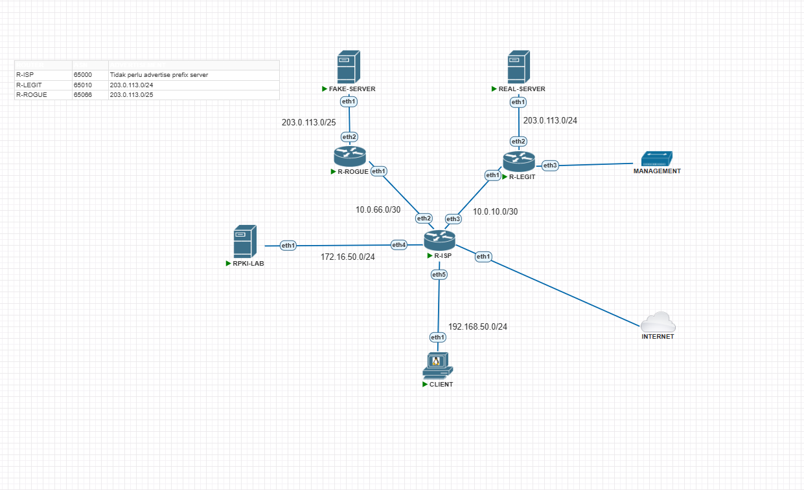

| Perangkat | Peran dalam lab |
| --- | --- |
| R-ISP (AS65000) | Menerima route dari kedua peer dan menjadi gateway CLIENT. Filter RPKI diterapkan di sini. |
| R-LEGIT (AS65010) | Mengumumkan `203.0.113.0/24`, jaringan menuju REAL-SERVER. |
| R-ROGUE (AS65066) | Mengumumkan `203.0.113.0/25`, jaringan menuju FAKE-SERVER. |
| RPKI-LAB (`172.16.50.254`) | Menyediakan dataset lab melalui StayRTR pada TCP port `8282`. |
| CLIENT | Mengakses `203.0.113.50` untuk melihat server mana yang menerima trafik. |

REAL-SERVER dan FAKE-SERVER sama-sama menggunakan alamat tujuan `203.0.113.50`, tetapi berada di segmen yang terpisah di belakang router masing-masing. Gunakan gateway `203.0.113.1` pada keduanya, dengan subnet `/24` di sisi REAL-SERVER dan `/25` di sisi FAKE-SERVER. Jangan menghubungkan kedua segmen server ke satu broadcast domain.

### Kenapa Route /25 Bisa Mengalihkan Trafik?

Alamat `203.0.113.50` masuk ke dalam dua prefix: `203.0.113.0/24` dan `203.0.113.0/25`. Ketika keduanya tersedia untuk forwarding, router menggunakan **longest prefix match**, yaitu kecocokan prefix yang paling spesifik. Karena `/25` lebih spesifik daripada `/24`, paket menuju alamat tersebut diarahkan ke R-ROGUE.

Ini bukan perbandingan AS path antara dua route untuk prefix yang sama. Kedua prefix berbeda dan bisa sama-sama ada di routing table, tetapi lookup tujuan `203.0.113.50` memilih `/25`. Alamat di bagian lain `/24`, misalnya `203.0.113.200`, tidak termasuk dalam `/25` tersebut.

## Konfigurasi Setup Awal (Belum Menggunakan RPKI)

Contoh konfigurasi memakai sintaks RouterOS v7. Cocokkan nama interface dengan topologi sebelum menjalankan perintah. Blok `add` ditujukan untuk konfigurasi awal; menjalankannya berulang kali bisa membuat entri ganda.

Siapkan web server HTTP di kedua server terlebih dahulu. Perintah berikut hanya mengganti halaman pada document root `/var/www/html`, sehingga layanan web harus sudah terpasang dan aktif. Gunakan shell root atau hak akses yang sesuai untuk menulis file tersebut.

### FAKE-SERVER
```bash
echo "FAKE-SERVER" > /var/www/html/index.html
```

### REAL-SERVER
```bash
echo "REAL-SERVER" > /var/www/html/index.html
```

### R-ISP

R-ISP memiliki dua sesi eBGP: `TO-LEGIT` dan `TO-ROGUE`. Pada tahap awal belum ada filter inbound RPKI, sehingga lab dapat memperlihatkan pengaruh pengumuman dari R-ROGUE. Chain `ISP-OUT` menolak seluruh pengumuman keluar karena pengujian ini hanya membutuhkan ISP menerima prefix dari kedua router.

Interface loopback digunakan untuk menempatkan router ID. Sementara itu, NAT melalui `ether1` ditujukan untuk akses ke jaringan upstream sesuai lingkungan lab.
```bash
# konfigurasi awal R-ISP
/system identity set name=R-ISP
/tool romon set enabled=yes

# konfigurasi IP address
/interface bridge add name=loopback protocol-mode=none

/ip address
add address=10.0.10.1/30 interface=ether3 network=10.0.10.0
add address=10.0.66.1/30 interface=ether2 network=10.0.66.0
add address=172.16.50.1/24 interface=ether4 network=172.16.50.0
add address=192.168.50.1/24 interface=ether5 network=192.168.50.0
add address=10.255.0.1 comment="Router ID" interface=loopback network=10.255.0.1

# konfigurasi NAT
/ip firewall nat add action=masquerade chain=srcnat out-interface=ether1

# konfigurasi BGP
/routing bgp connection
add address-families=ip as=65000 disabled=no local.address=10.0.10.1 .role=ebgp name=TO-LEGIT output.filter-chain=ISP-OUT remote.address=10.0.10.2/32 .as=65010 router-id=10.255.0.1 routing-table=main
add address-families=ip as=65000 disabled=no local.address=10.0.66.1 .role=ebgp name=TO-ROGUE output.filter-chain=ISP-OUT remote.address=10.0.66.2/32 .as=65066 router-id=10.255.0.1 routing-table=main

/routing filter rule add chain=ISP-OUT rule=reject
```

Konfigurasi tambahan DHCP menyediakan alamat untuk segmen lab dan CLIENT. Static lease mengikat IP ke MAC address tertentu; sesuaikan MAC di bawah dengan perangkat yang kamu gunakan, terutama agar RPKI-LAB mendapatkan `172.16.50.254`.
```bash
/ip pool
add name=dhcp_pool0 ranges=172.16.50.2-172.16.50.254
add name=dhcp_pool1 ranges=192.168.50.2-192.168.50.254
/ip dhcp-server
add address-pool=dhcp_pool0 interface=ether4 name=dhcp1
add address-pool=dhcp_pool1 interface=ether5 name=dhcp2
/ip dhcp-client add interface=ether1
/ip dhcp-server lease
add address=172.16.50.254 mac-address=50:00:00:11:00:01 server=dhcp1
add address=192.168.50.253 mac-address=50:00:00:14:00:01 server=dhcp2
/ip dhcp-server network
add address=172.16.50.0/24 gateway=172.16.50.1
add address=192.168.50.0/24 gateway=192.168.50.1
```

### R-LEGIT

R-LEGIT mengumumkan prefix `/24` melalui daftar `LEGIT-NETWORKS`. Filter output membatasi pengumuman ke prefix tersebut. Route blackhole ber-distance `254` menjadi cadangan untuk prefix yang diiklankan; selama jaringan server terhubung, connected route dengan distance lebih rendah yang digunakan.
```bash
# konfigurasi awal R-LEGIT
/system identity set name=R-LEGIT
/tool romon set enabled=yes

# konfigurasi IP address
/interface bridge add name=loopback protocol-mode=none

/ip address
add address=10.0.10.2/30 interface=ether1 network=10.0.10.0
add address=203.0.113.1/24 interface=ether2 network=203.0.113.0
add address=10.255.0.10 comment="Router ID" interface=loopback network=10.255.0.10

# Konfigurasi NAT
/ip firewall nat add action=masquerade chain=srcnat out-interface=ether1

# Konfigurasi DHCP, ROUTE
/ip dhcp-client add interface=ether1
/ip route
add disabled=no dst-address=0.0.0.0/0 gateway=10.0.10.1 routing-table=main suppress-hw-offload=no
add blackhole distance=254 dst-address=203.0.113.0/24

# Konfigurasi Firewall
/ip firewall address-list add address=203.0.113.0/24 list=LEGIT-NETWORKS

# Konfigurasi BGP
/routing bgp connection
add address-families=ip as=65010 disabled=no local.address=10.0.10.2 .role=ebgp name=TO-ISP output.filter-chain=LEGIT-OUT .network=LEGIT-NETWORKS remote.address=10.0.10.1/32 .as=65000 router-id=10.255.0.10 routing-table=main

# Konfigurasi Filter
/routing filter rule add chain=LEGIT-OUT rule="if (dst == 203.0.113.0/24) { accept }"
```

### R-ROGUE

R-ROGUE mengumumkan `/25` dari AS65066 untuk mensimulasikan pengumuman yang tidak diotorisasi. Prefix ini mencakup IP server yang diakses CLIENT, sehingga efeknya bisa diamati langsung melalui respons HTTP.

> Pada kedua router, `ether1` sudah diberi IP transit statis. DHCP client pada interface tersebut hanya diperlukan jika lingkungan lab memang menyediakannya; pada link transit statis ini, baris DHCP client dapat dilewati.
```bash
# konfigurasi awal R-ROGUE
/system identity set name=R-ROGUE
/tool romon set enabled=yes

# konfigurasi IP address
/interface bridge add name=loopback protocol-mode=none

/ip address
add address=10.0.66.2/30 interface=ether1 network=10.0.66.0
add address=203.0.113.1/25 interface=ether2 network=203.0.113.0
add address=10.255.0.66 comment="Router ID R-ROGUE" interface=loopback network=10.255.0.66

# Konfigurasi NAT
/ip firewall nat add action=masquerade chain=srcnat out-interface=ether1

# Konfigurasi DHCP, ROUTE
/ip dhcp-client add interface=ether1
/ip route
add disabled=no dst-address=0.0.0.0/0 gateway=10.0.66.1 routing-table=main suppress-hw-offload=no
add blackhole distance=254 dst-address=203.0.113.0/25

# Konfigurasi Firewall
/ip firewall address-list add address=203.0.113.0/25 list=ROGUE-NETWORKS

# Konfigurasi BGP
/routing bgp connection
add address-families=ip as=65066 disabled=no local.address=10.0.66.2 .role=ebgp name=TO-ISP output.filter-chain=ROGUE-OUT .network=ROGUE-NETWORKS .redistribute=connected remote.address=10.0.66.1/32 .as=65000 router-id=10.255.0.66 routing-table=main

# Konfigurasi Filter
/routing filter rule add chain=ROGUE-OUT rule="if (dst == 203.0.113.0/25) { accept; } else { reject; }"
```

---

## Testing Awal (Belum Menggunakan RPKI)

Pastikan sesi menuju R-LEGIT sudah established dan CLIENT dapat menjangkau gateway-nya. Di R-ISP, periksa sesi dan route dengan:

```bash
/routing bgp session print detail
/ip route print detail where dst-address=203.0.113.0/24
/ip route print detail where dst-address=203.0.113.0/25
```

### Saat BGP R-ROGUE Tidak Aktif

Nonaktifkan connection `TO-ROGUE` di R-ISP untuk mendapatkan kondisi pembanding:

```bash
/routing bgp connection disable [find where name="TO-ROGUE"]
```

Dari CLIENT, jalankan `curl http://203.0.113.50`. Hasil yang diharapkan adalah `REAL-SERVER` karena hanya route `/24` melalui R-LEGIT yang tersedia untuk tujuan tersebut.
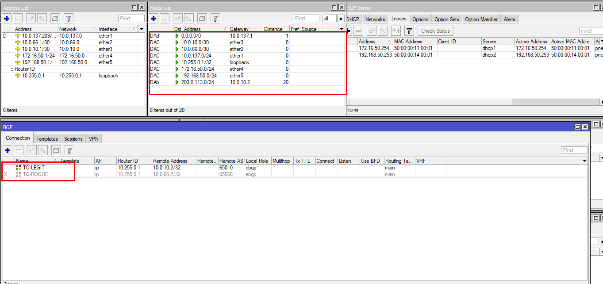

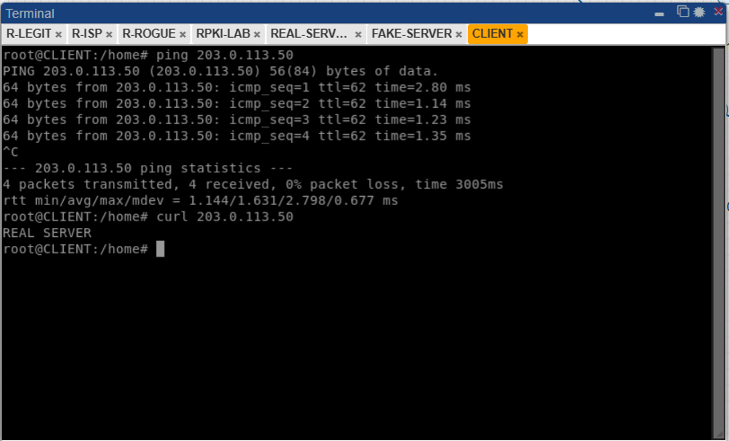

### Saat BGP R-ROGUE Aktif

Aktifkan kembali connection di R-ISP, tunggu sesi established, lalu ulangi akses dari CLIENT:

```bash
/routing bgp connection enable [find where name="TO-ROGUE"]
```

Sekarang hasil yang diharapkan adalah `FAKE-SERVER`. Periksa bahwa `/25` mengarah ke `10.0.66.2`, sedangkan `/24` tetap mengarah ke `10.0.10.2`. Pergantian hasil HTTP menunjukkan efek pemilihan route yang lebih spesifik.
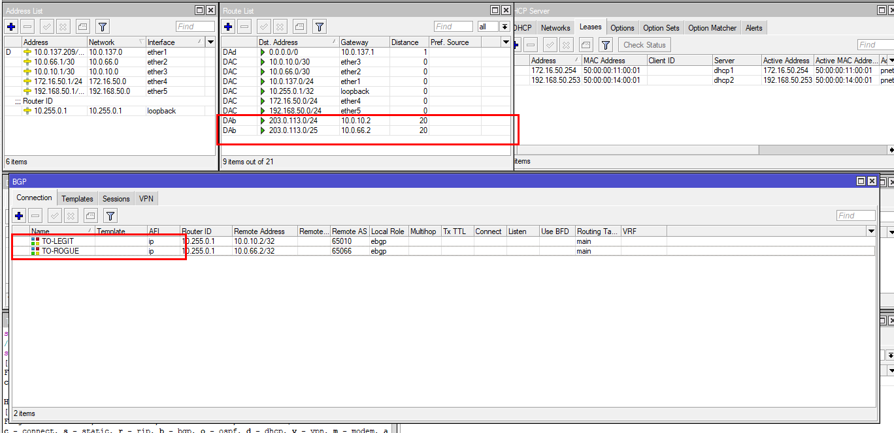

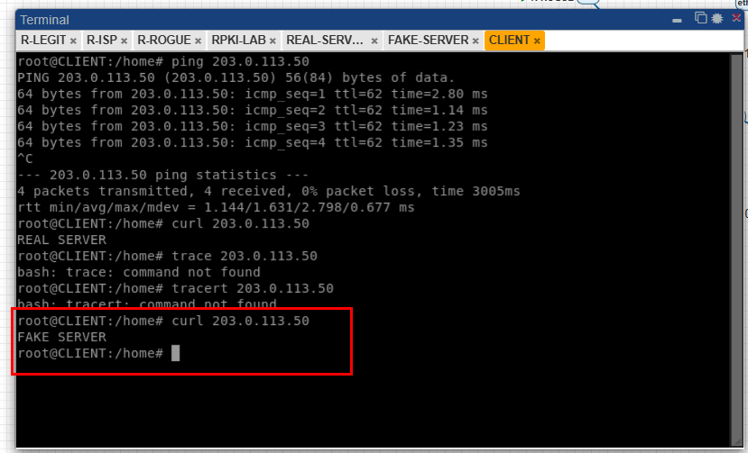

---

## Konfigurasi RPKI
### RPKI-LAB

[StayRTR](https://github.com/bgp/stayrtr/) menyajikan payload dari dataset kepada router melalui RTR. Dalam lab ini, dataset disediakan secara lokal agar hasil validasi dapat dikontrol. Pada penerapan nyata, sumber payload berasal dari validator RPKI yang memvalidasi data publik.

Untuk mengakses container lab, masuk melalui SSH ke host PNETLab, cari container yang sesuai, lalu buka shell-nya. Jika container tidak memiliki `bash`, gunakan `sh`.
```bash
docker ps #cari tau dimana container stayrtr
docker exec -it <container_id> bash
```

```bash
apt update
apt install -y software-properties-common
add-apt-repository -y universe
apt update
apt install -y stayrtr

# alternatif: gunakan binary v0.6.4 pada Linux x86_64
cd /home
wget https://github.com/bgp/stayrtr/releases/download/v0.6.4/rtrmon-v0.6.4-linux-x86_64 -O rtrmon
wget https://github.com/bgp/stayrtr/releases/download/v0.6.4/stayrtr-v0.6.4-linux-x86_64 -O stayrtr

chmod +x stayrtr
chmod +x rtrmon
```

Pilih salah satu cara instalasi: paket atau binary. Perintah repository `universe` di atas khusus Ubuntu dan ketersediaan paket bergantung pada rilis OS. Contoh unduhan mempertahankan versi lab, bukan penanda versi terbaru. Opsi `wget -O` memakai huruf O besar untuk menentukan nama file hasil unduhan. `rtrmon` merupakan alat pemantauan tambahan dan tidak diperlukan untuk menjalankan server RTR ini.

### Membuat Dataset VRP

Dataset berikut mengizinkan AS65010 mengumumkan `203.0.113.0/24` dengan panjang maksimum `/24`:
```bash
sudo mkdir -p /opt/rpki-lab
sudo tee /opt/rpki-lab/vrps.json >/dev/null <<'EOF'
{
  "roas": [
    {
      "prefix": "203.0.113.0/24",
      "maxLength": 24,
      "asn": 65010
    }
  ]
}
EOF
```

Arti masing-masing field:

| Field | Arti dalam skenario ini |
| --- | --- |
| `prefix` | Blok jaringan yang dicakup otorisasi. |
| `maxLength` | Panjang prefix paling spesifik yang diizinkan; nilai `24` tidak mengizinkan `/25`. |
| `asn` | Origin AS yang diizinkan, yaitu AS65010. |

Dengan dataset tunggal ini, `/24` dari AS65010 akan valid. Pengumuman `/25` dari AS65066 invalid karena origin AS tidak cocok dan panjang prefix melewati batas. Bahkan `/25` dari AS65010 tetap invalid karena `maxLength` masih `24`.

### Menjalankan HTTP Server dan StayRTR

Pada terminal pertama di RPKI-LAB, sajikan file JSON melalui HTTP lokal:
```bash
cd /opt/rpki-lab
python3 -m http.server 8000 --bind 127.0.0.1
```

<!-- terminal ke 2
```bash
stayrtr \
  -bind :8282 \
  -cache http://127.0.0.1:8000/vrps.json
```

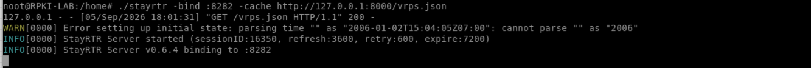 -->

Pada terminal kedua di container yang sama, jalankan StayRTR. Contoh memakai binary `/home/stayrtr`; jika memakai paket, ganti `/home/stayrtr` dengan `stayrtr` sesuai lokasi instalasinya.
```bash
/home/stayrtr \
  -bind :8282 \
  -cache http://127.0.0.1:8000/vrps.json \
  -checktime=false \
  -etag=false \
  -last.modified=false
```

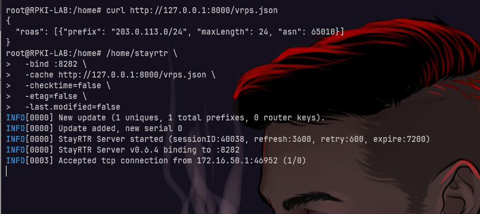

HTTP port `8000` hanya digunakan StayRTR untuk membaca JSON dari localhost. R-ISP mengakses layanan RTR pada port `8282`. Biarkan kedua proses tetap berjalan selama pengujian. Jika container memakai jaringan bridge Docker, pastikan alamat dan port RTR tersebut memang dapat dijangkau dari R-ISP.

Opsi `-checktime=false` menonaktifkan pemeriksaan waktu dataset untuk contoh statis ini. Opsi `-etag=false` dan `-last.modified=false` menonaktifkan penggunaan metadata HTTP terkait saat mengambil dataset. Pengaturan ini dipakai untuk fixture lab sederhana; jangan menjadikannya pengganti mekanisme pembaruan dan kedaluwarsa data pada deployment nyata.

### Menghubungkan R-ISP ke RTR Cache

Tambahkan RTR cache di R-ISP:
```bash
/routing rpki add group=LAB-RPKI address=172.16.50.254 port=8282 refresh-interval=20

# cek status RPKI
/routing rpki print detail
```

Pastikan cache tersambung dan data sudah tersinkron sebelum melanjutkan. Koneksi cache saja belum menerapkan kebijakan penolakan route. MikroTik memisahkan pemeriksaan RPKI dan tindakan filter, sebagaimana dicontohkan pada [dokumentasi RPKI RouterOS](https://help.mikrotik.com/docs/spaces/ROS/pages/59277471/RPKI).

Uji VRP secara manual:
```bash
/routing rpki rpki-check group=LAB-RPKI prefix=203.0.113.0/24 origin-as=65010
```

> hasilnya: valid

Tes malicious advertisement:
```bash
/routing rpki rpki-check group=LAB-RPKI prefix=203.0.113.0/25 origin-as=65066
```

> hasilnya: invalid

Tes prefix tanpa VRP:
```bash
/routing rpki rpki-check group=LAB-RPKI prefix=198.51.100.0/24 origin-as=65066
```

> hasilnya: unknown

`unknown` berarti tidak ada VRP yang mencakup prefix tersebut; ini berbeda dari `invalid`. RouterOS juga memiliki status `unverified` ketika belum ada sesi dalam grup RPKI yang menyinkronkan database. Bila hasil berbeda, periksa sinkronisasi cache terlebih dahulu. Pada versi yang menggunakan nama argumen `prfx`, sesuaikan `prefix` pada perintah `rpki-check` melalui bantuan CLI.

Pada tahap ini, coba lagi dari CLIENT:
```bash
curl 203.0.113.50
# FAKE SERVER
```

> Hasilnya masih FAKE SERVER. Itu normal karena RPKI baru memberikan data validasi, belum ada policy yang menolak route Invalid.

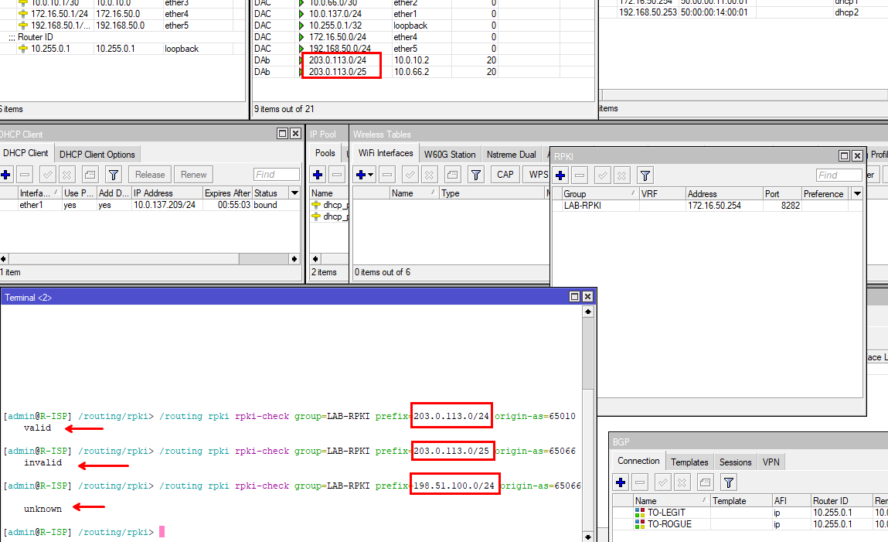

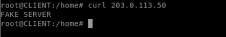

### Mengaktifkan RPKI Filtering

Rule pertama menjalankan validasi terhadap grup `LAB-RPKI`. Rule kedua menolak route berstatus `invalid`, lalu menerima status lainnya. Artinya, kebijakan lab ini juga menerima `unknown` dan `unverified`; kebijakan ini bukan filter yang hanya menerima route `valid`.

Pada konfigurasi yang sudah memiliki filter inbound, gabungkan pemeriksaan ini dengan kebijakan yang ada. Perintah berikut mengganti chain input pada kedua connection.

Buat filter di R-ISP:
```bash
/routing filter rule
add chain=RPKI-IN rule="rpki-verify LAB-RPKI"
add chain=RPKI-IN rule="if (rpki invalid) { reject } else { accept }"
```

Pasang filter ke kedua sesi inbound di R-ISP:
```bash
/routing bgp connection
set [find where name="TO-LEGIT"] input.filter=RPKI-IN

/routing bgp connection
set [find where name="TO-ROGUE"] input.filter=RPKI-IN
```

Untuk pengujian lab, restart kedua connection agar route diterima kembali dan diproses dengan filter baru. Sesi BGP dan route terkait akan terputus sementara selama proses ini.

```bash
/routing bgp connection
disable [find where name="TO-LEGIT"]
disable [find where name="TO-ROGUE"]
enable [find where name="TO-LEGIT"]
enable [find where name="TO-ROGUE"]
```

Tunggu kedua sesi established kembali, lalu periksa route `/24` dan `/25` di R-ISP.

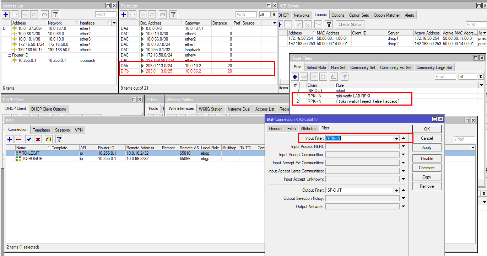

> Route `/25` yang invalid ditolak oleh filter dan tidak digunakan untuk forwarding. Entri yang ditolak masih dapat terlihat sebagai filtered pada tampilan route RouterOS; keberadaan entri tersebut tidak berarti route aktif.

kita test di CLIENT:
```bash
curl http://203.0.113.50
```

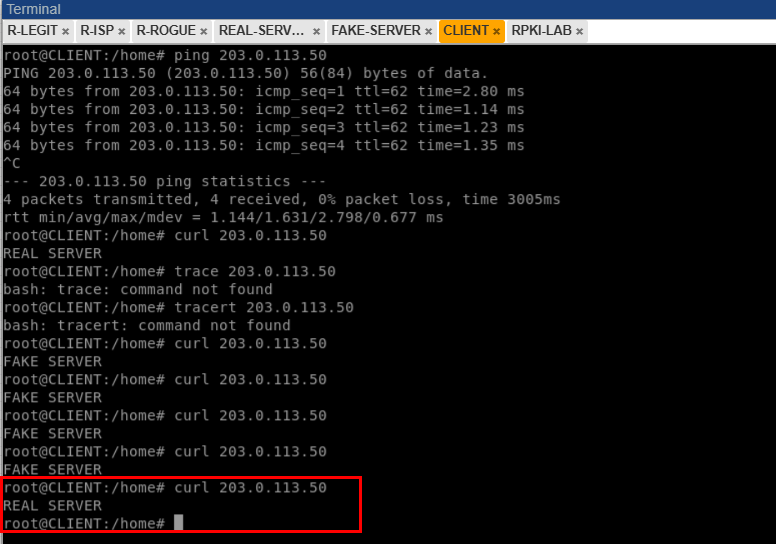

Hasil yang diharapkan adalah `REAL-SERVER`. Setelah `/25` ditolak, trafik menuju `203.0.113.50` kembali cocok dengan route `/24` melalui R-LEGIT. Pastikan sesi R-ROGUE tetap established: dengan begitu, hasil ini menunjukkan pengaruh filter, bukan sekadar peer yang mati.

## Membandingkan Hasil Pengujian

| Kondisi | Route untuk akses ke `203.0.113.50` | Respons yang diharapkan |
| --- | --- | --- |
| R-ROGUE tidak aktif | `/24` melalui R-LEGIT | `REAL-SERVER` |
| R-ROGUE aktif, belum ada filter RPKI | `/25` melalui R-ROGUE | `FAKE-SERVER` |
| Cache RPKI sudah sinkron, filter belum dipasang | `/25` masih diterima | `FAKE-SERVER` |
| Filter menolak invalid pada kedua peer | `/25` ditolak, `/24` digunakan | `REAL-SERVER` |

## Troubleshooting

| Gejala | Pemeriksaan yang perlu dilakukan |
| --- | --- |
| Sesi BGP belum established | Periksa IP transit, remote AS, status connection, dan konektivitas TCP port `179`. |
| RPKI-LAB tidak tersambung | Periksa IP `172.16.50.254`, proses StayRTR, firewall, serta akses TCP port `8282`. |
| Dataset tidak terbaca | Dari RPKI-LAB, jalankan `curl http://127.0.0.1:8000/vrps.json` dan periksa log StayRTR. |
| Prefix lab menghasilkan `unknown` | Pastikan dataset yang dimuat benar-benar memuat prefix `/24` tersebut dan cache sudah diperbarui. |
| Hasil masih `FAKE-SERVER` setelah filtering | Periksa pemasangan chain pada input kedua peer, urutan rule, dan apakah route `/25` masih aktif. |
| Tidak ada respons HTTP | Periksa layanan web, IP dan gateway server, serta konektivitas CLIENT; kegagalan HTTP saja belum membuktikan filter bekerja. |

Keberhasilan lab ditunjukkan oleh gabungan tiga hal: `/24` dari AS65010 valid dan tetap tersedia, `/25` dari AS65066 invalid serta ditolak, dan CLIENT kembali menerima halaman `REAL-SERVER`. Data RPKI memberi dasar pemeriksaan, sedangkan routing policy menentukan tindakan terhadap hasilnya.
