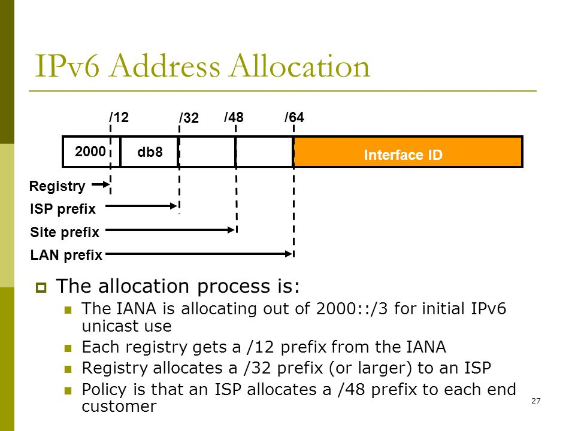

# IPv6
IPv6 adalah versi terbaru dari protokol internet yang menggunakan alamat 128-bit. IPv6 dikembangkan untuk mengatasi keterbatasan IPv4 dalam hal kapasitas alamat dan efisiensi jaringan.

### Karakteristik IPv6
- Menggunakan **128-bit**, dibandingkan dengan IPv4 yang hanya **32-bit**.
- Terdiri dari **8 kelompok** (hextet), masing-masing mewakili **16-bit**.
- Ditulis dalam format **hexadecimal** dan dipisahkan oleh tanda **:**.
- **Tidak memiliki konsep subnet mask** seperti IPv4, melainkan menggunakan **prefix length (/64, /48, dll.)**.

#### Penyederhanaan Penulisan IPv6
1. **Menghilangkan angka nol di depan**
   - **0db2** menjadi **db2**
   - **0002** menjadi **2**
   - **0101** menjadi **101**
2. **Menggunakan :: untuk menggantikan kelompok 0000 yang berurutan**
   - **0000:0000:0000:0000** menjadi **::**
   - **2001:DB8:0000:1111:0000:0000:0000:0200** menjadi **2001:DB8:0:1111::200**
   - **fe80:0000:0000:0000:0000:0000:0101:1111** menjadi **fe80::101:1111**

---

## Subnetting IPv6
Subnetting pada IPv6 tidak menggunakan subnet mask seperti IPv4, melainkan menggunakan **prefix length** yang menentukan jumlah bit untuk network dan host.

### Format Standar Prefix IPv6
- **/32** → Umumnya digunakan oleh ISP
- **/48** → Standar yang diberikan oleh ISP ke pelanggan
- **/64** → Standar untuk subnet LAN
- **/128** → 1 alamat (host tunggal)

### Cara Subnetting IPv6
Misalkan kita memiliki blok IPv6 **2001:db8::/48** dari ISP, kita bisa membaginya menjadi beberapa subnet dengan ukuran yang lebih kecil:
1. **2001:db8:0001::/64**
2. **2001:db8:0002::/64**
3. **2001:db8:0003::/64**

Untuk mendapatkan **subnet /64 dari /48**, kita cukup menambahkan 16-bit lagi.

Jika kita ingin membuat subnet /56 dari /48:
- **2001:db8:00A0::/56**
- **2001:db8:00A1::/56**

#### **Penjelasan Detail Subnetting IPv6**
**1. Dari /48 ke /64**  
- **Prefix /48** berarti **48-bit pertama** digunakan untuk **network**.  
- **Subnet /64** berarti **64-bit pertama** digunakan untuk **network**.  
- Jadi, kita harus **menambahkan 16-bit** tambahan untuk subnetting.

Misal kita punya blok **2001:db8::/48**, kita bisa menambahkan 16-bit di posisi berikut:  
**2001:0db8:xxxx:yyyy::/64**  
(xxxx dan yyyy adalah variabel untuk subnet)

Contoh subnet /64 dari **2001:db8::/48**:
- **2001:db8:0001::/64**
- **2001:db8:0002::/64**
- **2001:db8:0003::/64**

**2. Dari /48 ke /56**  
- **Prefix /56** berarti **56-bit pertama** digunakan untuk **network**.  
- **Dari /48 ke /56** berarti kita hanya perlu **menambahkan 8-bit** tambahan.  

Misal kita punya blok **2001:db8::/48**, kita bisa menambahkan 8-bit di posisi berikut:  
**2001:0db8:xxxx:zz::/56**  
(xxxx tetap, sedangkan zz adalah variabel untuk subnet)

Contoh subnet /56 dari **2001:db8::/48**:
- **2001:db8:00A0::/56**
- **2001:db8:00A1::/56**

Karena **8-bit bisa menampung 256 kemungkinan nilai (0-255)**, kita bisa membuat **256 subnet /56** dari satu blok /48.

---

## IP Loopback IPv6
IPv6 memiliki alamat loopback khusus **::1/128**, yang setara dengan **127.0.0.1** pada IPv4. 
Alamat ini digunakan untuk menguji koneksi lokal pada perangkat sendiri.

---

## DHCPv6 dan IP Automation
IPv6 mendukung beberapa metode untuk konfigurasi otomatis alamat IP:
1. **Stateless Address Autoconfiguration (SLAAC)**
   - Perangkat otomatis menghasilkan alamat berdasarkan **prefix** yang dikirim router.
   - Tidak memerlukan server DHCPv6.
2. **Stateful DHCPv6**
   - Server DHCPv6 menetapkan alamat IPv6 secara dinamis ke perangkat, mirip dengan DHCP pada IPv4.
3. **DHCPv6 Prefix Delegation**
   - ISP memberikan subnet ke pelanggan secara otomatis.

---

## Alamat IPv6 dari ISP
ISP biasanya memberikan blok IPv6 dengan ukuran **/48 atau /56**, yang dapat digunakan untuk membuat subnet di jaringan internal.

- Jika diberikan **/48**, kita bisa membuat **65536 subnet /64**
- Jika diberikan **/56**, kita bisa membuat **256 subnet /64**

Alamat yang diberikan ISP bisa dalam format:
- **2001:db8::/48**
- **2404:6800::/32** (Google)

---

## EUI-64: Cara Menghitung IPv6 dari MAC Address
IPv6 mendukung metode **EUI-64** untuk menghasilkan alamat dari MAC Address perangkat.

### Cara Kerja EUI-64:
1. Ambil MAC Address perangkat (contoh: **00:1A:2B:3C:4D:5E**).
2. Sisipkan **FF:FE** di tengah, sehingga menjadi **00:1A:2B:FF:FE:3C:4D:5E**.
3. Balik bit ke-7 (Universal/Local bit) pada oktet pertama:
   - **00** dalam biner: **00000000** → ubah bit ke-7 → **00000010** (**02** dalam hex)
   - Hasilnya menjadi **02:1A:2B:FF:FE:3C:4D:5E**.
4. Format ulang ke dalam IPv6, misalnya dengan prefix **FE80::/64**:
   - **FE80::21A:2BFF:FE3C:4D5E**

Dengan metode ini, perangkat bisa otomatis mendapatkan alamat IPv6 berdasarkan MAC Address tanpa perlu konfigurasi manual.

---

## Multicast dan Anycast IPv6
IPv6 tidak menggunakan **broadcast** seperti IPv4, tetapi menggantinya dengan **multicast**.

### Multicast IPv6
- Menggunakan alamat dengan awalan **FF00::/8**.
- Contoh alamat multicast penting:
  - **FF02::1** → Semua perangkat di jaringan lokal.
  - **FF02::2** → Semua router di jaringan lokal.

### Anycast IPv6
- Beberapa perangkat dapat berbagi satu alamat **Anycast**.
- Paket yang dikirim ke alamat Anycast akan diterima oleh perangkat terdekat.

---

## Tabel Jenis Alamat IPv6
| Jenis Alamat | Deskripsi |
|-------------|-----------|
| **Unicast** | Alamat unik untuk satu perangkat. |
| **Multicast** | Alamat untuk mengirim paket ke beberapa perangkat sekaligus. |
| **Anycast** | Alamat yang dibagikan oleh beberapa perangkat, tetapi paket dikirim ke yang terdekat. |

---

## Keuntungan IPv6 dibanding IPv4
1. **Ruang alamat lebih besar** → IPv6 memiliki **2^128** alamat unik.
2. **Tidak perlu NAT (Network Address Translation)** → Setiap perangkat dapat memiliki alamat publik.
3. **Lebih efisien dalam routing** → Tidak ada fragmentasi paket.
4. **Keamanan bawaan dengan IPsec** → Semua komunikasi dapat dienkripsi secara default.

IPv6 menawarkan solusi jangka panjang untuk kebutuhan alamat internet dan memiliki fitur lebih baik dibanding IPv4, seperti **keamanan bawaan (IPsec), efisiensi routing, dan skalabilitas yang lebih besar**.