# USK Paket 1 PT Bonet

## A. Topologi


### 1. Mikrotik
### 2. Proxmox

## B.  Konfigurasi Mikrotik
### 1. setup
#### a. Mengubah Identitas Router


#### b. Menambahkan IP DHCP-Client pada Ether1 untuk Akses Internet


#### c. Menetapkan IP Address pada Interface Ether2 dan Ether3
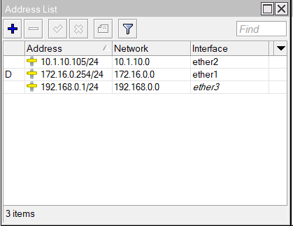

#### d. Verifikasi Koneksi ke Internet dan Server Proxmox Lokal
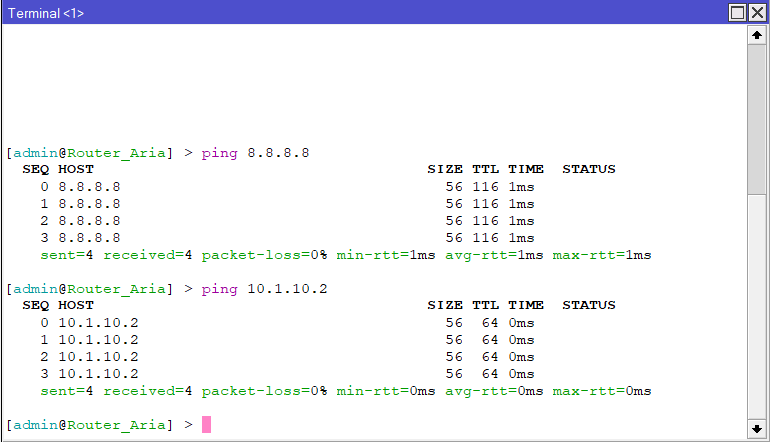

#### e. Mengonfigurasi Firewall NAT untuk Akses Internet melalui Ether1 serta Bypass untuk Akses Klien ke VM Proxmox


<!-- truncate -->

### 2. Hotspot
#### a. Membuat Hotspot pada Interface Lokal (Ether3)
1. Interface: `ether3` (lokal) \
   
2. Address Lokal: `192.168.0.1/24` \
   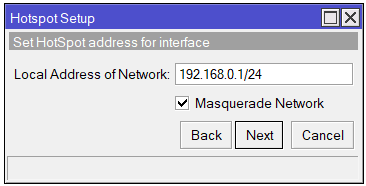
3. Rentang Alamat IP Pool: `192.168.0.2-192.168.0.100` \
   
4. DNS Server: `192.168.0.1` (gateway) dan `8.8.8.8` untuk internet
   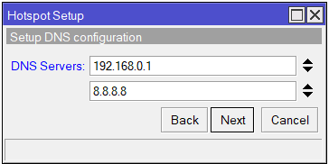
5. Nama Domain Hotspot: `login.usk-tkj.net` *(opsional)*
   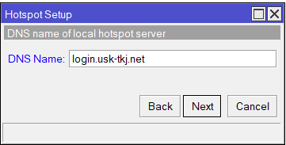
6. Menonaktifkan *Cookie Server* pada Hotspot untuk meningkatkan keamanan akses.
   

#### b. Membuat Pengguna dengan Pengaturan Bandwidth dan Address List
1. Membuat *User Profile* untuk kategori *staff* dan *guest*, dengan batasan bandwidth `5 Mbps` untuk *staff* dan `2 Mbps` untuk *guest*.
   
2. Menambahkan pengguna dengan profil yang telah dibuat.
   
3. Verifikasi login serta pengujian bandwidth untuk pengguna *staff*.
   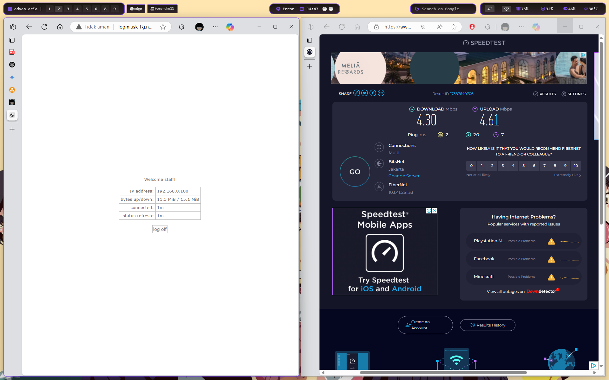
4. Pengujian bandwidth juga dilakukan untuk pengguna *guest*.
   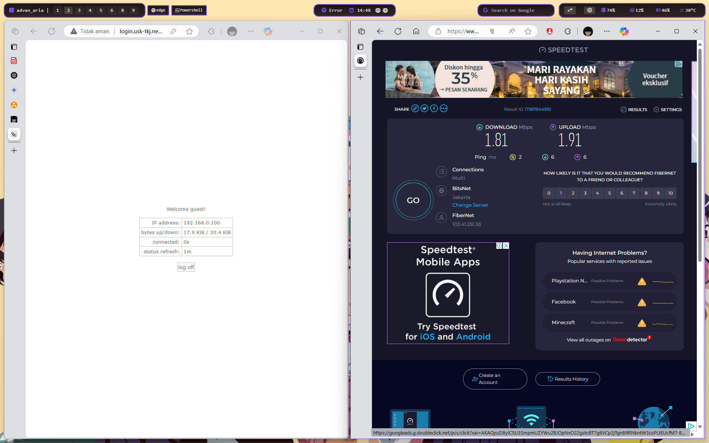

### 3. Firewall
#### a. Menambahkan Firewall untuk Membatasi Akses Guest ke Server Proxmox
1. Membuat aturan firewall dengan *chain forward* serta *dst-address* menuju `10.1.10.0/24`.
   
2. Menambahkan *src-address-list* untuk mengidentifikasi pengguna *guest*.
   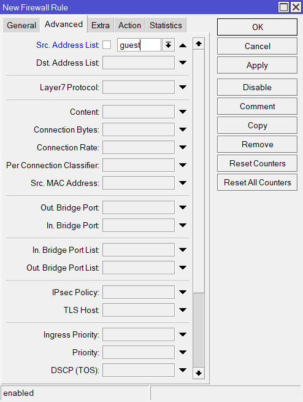
3. Mengatur aksi *drop* untuk memblokir akses pengguna *guest* ke server VM.
   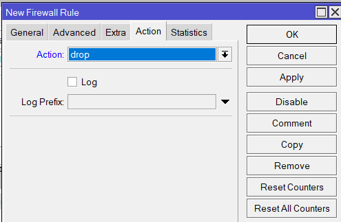
4. Verifikasi bahwa pengguna *staff* masih bisa melakukan *ping* ke `8.8.8.8` dan `10.1.10.2`.
   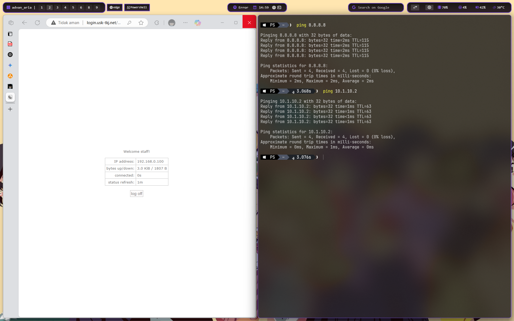
5. Verifikasi bahwa pengguna *guest* tidak dapat mengakses VM Proxmox.
   
6. Jika dalam soal hanya diminta untuk memblokir akses ke router, tambahkan aturan firewall dengan protocol seperti FTP (`21`) dan SSH (`22`), atau sesuai dengan ketentuan soal.
   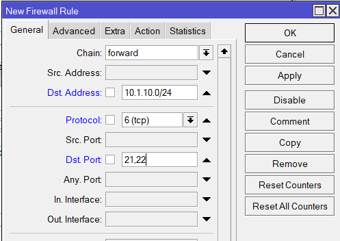

### 4. Konfigurasi DNS
#### a. Menambahkan DNS Statis untuk Lookup ke VM1 dan VM2
1. **Mengaktifkan Allow Remote Request**
   - Mengaktifkan opsi *Allow Remote Request* untuk memungkinkan permintaan DNS dari klien eksternal.
   - Menambahkan konfigurasi DNS Server untuk VM1.
   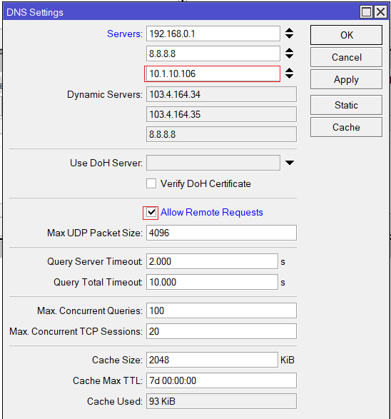
2. **Menambahkan DNS Statis**
   - Menambahkan entri DNS statis untuk domain berikut:
     - `usk-tkj.net` → Mengarah ke VM1
     - `ftp.usk-tkj.net` → Mengarah ke VM1
     - `www.usk-tkj.net` → Mengarah ke VM2
   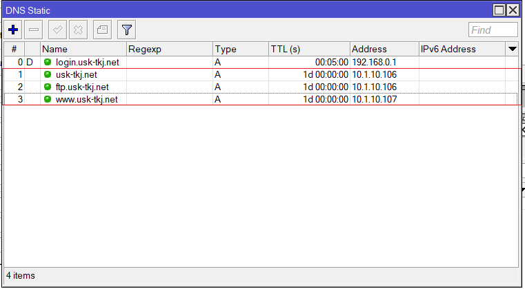

## C. Konfigurasi vm proxmox
### 1. setup hostname, dan ip
#### a. Setup Hostname dan IP
- Di sini saya menggunakan VM 201 dan VM 202.  
  
- Setelah itu, saya mengubah hostname untuk server 1 dan server 2 dengan nama `serv1` dan `serv2` menggunakan `nmtui` atau `hostnamectl`.  
  ```bash
  # Menggunakan nmtui
  nmtui

  # Menggunakan hostnamectl
  hostnamectl set-hostname serv1  # Untuk VM1
  hostnamectl set-hostname serv2  # Untuk VM2
  ```
- Selanjutnya, saya mengubah alamat IP sebagai berikut:
  - **VM1 (201)**: 10.1.10.106/24, dengan gateway 10.1.10.105, dan DNS server 10.1.10.105.  
    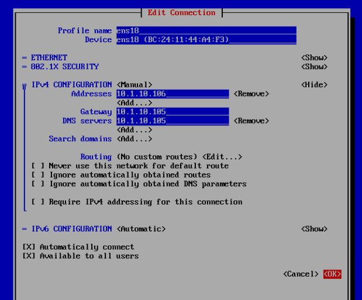
  - **VM2 (202)**: 10.1.10.107/24, dengan gateway 10.1.10.105, dan DNS server 10.1.10.105.  
    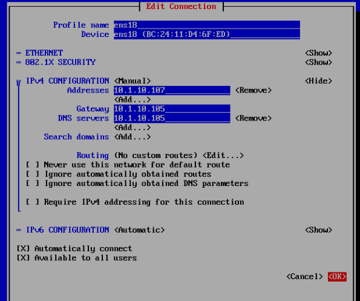

### 2. setup repository
#### a. Mematikan Repository Online
Buka file konfigurasi repository:
```bash
vi /etc/rhsm/rhsm.conf
```
Ubah baris berikut:
```ini
manage_repos = 1
```
Menjadi:
```ini
manage_repos = 0
```

#### b. Setup Repository Lokal
Buka atau buat file repository lokal:
```bash
vi /etc/yum.repos.d/local.repo
```
Tambahkan konfigurasi berikut:
```ini
[BaseOS]
name=BaseOS
baseurl=http://10.1.10.115/rhel9.4/BaseOS
gpgcheck=0
enabled=1

[AppStream]
name=AppStream
baseurl=http://10.1.10.115/rhel9.4/AppStream
gpgcheck=0
enabled=1
```
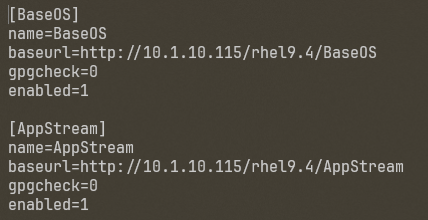
#### c. Verifikasi Repository
Pastikan repository sudah dapat digunakan dengan menjalankan perintah berikut:
```bash
yum repolist
```

Lakukan langkah ini di kedua VM.

### 3. konfigurasi ssh-key
Konfigurasi SSH Key dan PuTTYgen untuk Remote Access menggunakan OpenSSH dan PuTTY, serta Konfigurasi FTP Server
#### a. Membuat SSH Key
1. **Generate SSH Key dari VM 1**
   ```bash
   ssh-keygen
   # Tekan Enter untuk melanjutkan tanpa mengubah konfigurasi default
   ```
2. **Menyalin SSH Key ke VM 1 dan VM 2 menggunakan `ssh-copy-id`**
   ```bash
   ssh-copy-id root@10.1.10.106
   ssh-copy-id root@10.1.10.107
   ```
   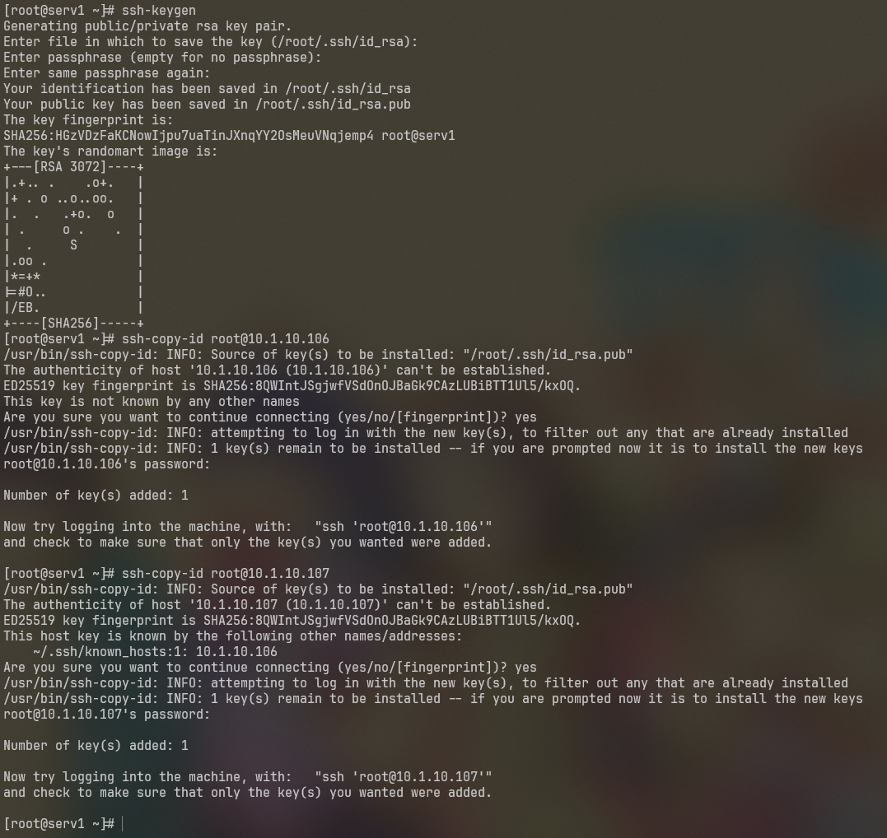
3. **Mengunduh Private Key (`id_rsa`) dari VM 1 menggunakan `scp` atau FileZilla**
   ```bash
   scp root@10.1.10.106:/root/.ssh/id_rsa .
   ```
   
4. **Membuat Kunci PPK untuk PuTTY menggunakan PuTTYgen**
   - Buka PuTTYgen
   - Pilih menu **Conversions > Import Key**
   - Pilih file `id_rsa` yang telah diunduh
   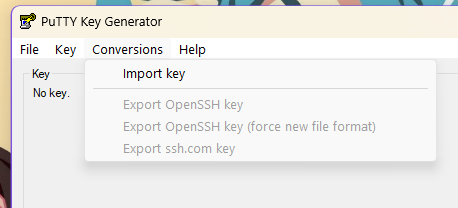
5. **Generate dan Simpan Private Key dalam Format PPK**
   - Klik **Save private key**
   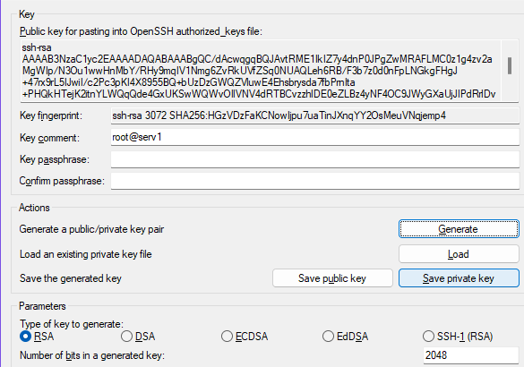
   - Simpan file dengan format `.ppk`
   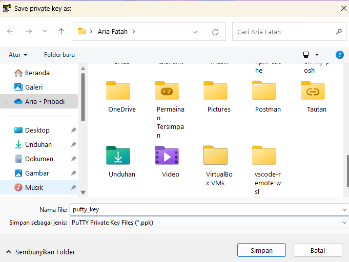
6. **Hasil Akhir: Dua Kunci Private untuk OpenSSH dan PuTTY**
   - **`id_rsa`** → Digunakan untuk koneksi dengan OpenSSH
   - **`id_rsa.ppk`** → Digunakan untuk koneksi dengan PuTTY
   

### 4. konfigurasi ftp server
#### a. Membuat FTP Server pada VM 1 dan Mengunggah Private Key
1. **Instalasi Paket**
  Jalankan perintah berikut untuk menginstal paket yang diperlukan:
  ```bash
  yum install vsftpd ftp -y
  ```
2. **Konfigurasi FTP Server**
  Edit file konfigurasi `vsftpd` dengan perintah:
  ```bash
  vi /etc/vsftpd/vsftpd.conf
  ```
  Kemudian ubah opsi `allow_anon_upload` menjadi `YES`.
  
  Tambahkan konfigurasi berikut di bagian bawah file untuk mengaktifkan mode passive:
  ```ini
  pasv_enable=YES
  pasv_min_port=10000
  pasv_max_port=10100
  ```
3. **Menjalankan dan Mengaktifkan vsftpd** \
  Setelah konfigurasi selesai, jalankan perintah berikut untuk mengaktifkan dan memulai layanan `vsftpd`:
  ```bash
  systemctl enable --now vsftpd
  ```
4. **Mengatur Firewall** \
  Agar koneksi ke FTP server dapat dilakukan, tambahkan aturan firewall untuk membuka port yang dibutuhkan:
  ```bash
  firewall-cmd --add-port={21/tcp,22/tcp,10000-10100/tcp} --permanent
  firewall-cmd --reload
  ```
5. **Mengakses FTP Server** \
  Setelah konfigurasi selesai, coba akses FTP server menggunakan FileZilla atau File Explorer dengan membuka alamat:
  ```bash
  ftp://<IP-Server>
  ```
   \
6. **Mengunggah Private Key dengan SCP** \
  Untuk mengunggah private key ke FTP server dengan lebih mudah, gunakan perintah SCP:
  ```bash
  scp id_rsa putty_key.ppk root@10.1.10.106:/var/ftp
  ```
  
  Setelah selesai, file private key akan tersedia di direktori `/var/ftp` pada FTP server.

### 5. Pengujian Login SSH
#### a. Menggunakan OpenSSH
- Gunakan opsi `-i id_rsa` saat melakukan SSH:
  ```bash
  ssh -i id_rsa user@hostname
  ```
  
#### b. Menggunakan PuTTY
1. Tambahkan kunci SSH pada PuTTY.
2. Masuk ke **SSH > Auth > Credentials**. \
   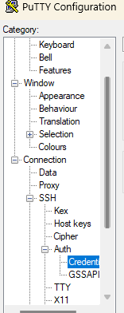
3. Unggah kunci **PPK**. \
   
4. buka menu sessions dan masukan ip vm 1 atau vm 2
   
5. Coba login melalui sesi PuTTY, seharusnya dapat masuk tanpa memasukkan password.
   

### 6. konfigurasi web server
#### a. buat container vm dengan podman
- installasi package
  ```bash
  yum install podman haproxy -y
  ```
- pull nginx
  ```bash
  podman pull nginx
  ```
- buat file index.html untuk web1 dan web2
  ```bash
  cd /home/skills99/
  mkdir -p web1 web2
  echo "web 1" > web1/index.html
  echo "web 2" > web2/index.html
  ```
- buat container web1 dan web 2
  ```bash
  podman run -itd --name web1 -p 8001:80 -v ./web1:/usr/share/share/nginx/html:Z nginx
  podman run -itd --name web2 -p 8002:80 -v ./web2:/usr/share/share/nginx/html:Z nginx
  ```